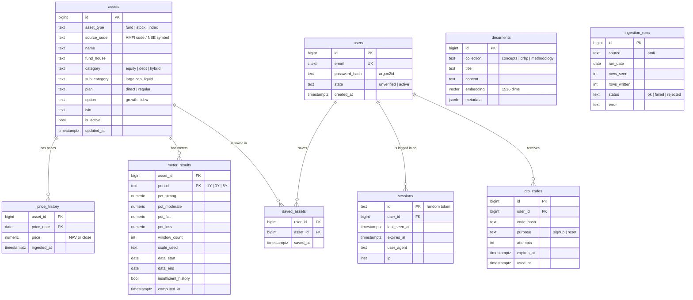

# Database — tables and diagram

**R1 tables.** Designed so stocks, IPOs and portfolios slot in later without changing anything here.

---

## 1. The simple picture

```
                    ┌──────────────┐
                    │    assets    │   every fund (and later every stock)
                    │              │
                    │  id          │
                    │  asset_type  │  ← "fund" now, "stock" in R3
                    │  name        │
                    │  category    │  ← decides which Meter scale
                    └──┬────────┬──┘
                       │        │
          ┌────────────┘        └────────────┐
          │                                  │
┌─────────▼─────────┐              ┌─────────▼─────────┐
│  price_history    │              │  meter_results    │
│                   │              │                   │
│  asset_id         │              │  asset_id         │
│  date             │              │  period (1Y/3Y/5Y)│
│  price            │              │  4 percentages    │
│                   │              │                   │
│  ~6 million rows  │              │  computed nightly │
└───────────────────┘              └───────────────────┘


┌──────────────┐                   ┌───────────────────┐
│    users     │                   │    documents      │
│              │                   │                   │
│  id          │                   │  collection       │ ← "concepts"
│  email       │                   │  content          │
│  password    │                   │  embedding        │ ← for Isaa search
└──┬────┬───┬──┘                   └───────────────────┘
   │    │   │
   │    │   └──────────────┐
   │    │                  │
┌──▼────────┐  ┌───────────▼──┐  ┌──────────────┐
│ sessions  │  │  otp_codes   │  │ saved_assets │
│ logged in │  │ email codes  │  │  user ↔ asset│
└───────────┘  └──────────────┘  └──────────────┘
```

Two groups that barely touch each other:

- **Left/top — the money data.** Assets, their prices, their Meters. No user involved.
- **Bottom — the person data.** Users, logins, what they saved.

They meet in exactly one place: `saved_assets`.

---

## 2. Full diagram



---

## 3. What each table is for

| Table | In plain words |
|---|---|
| **assets** | One row per fund. Later, also one row per stock. The centre of everything |
| **price_history** | Every NAV on every date. The biggest table — about 6 million rows |
| **meter_results** | The Meter answer, already calculated. Read this, never calculate live |
| **users** | Who can log in |
| **sessions** | Who is currently logged in, and on which device |
| **otp_codes** | The 6-digit email codes. Stored hashed, never as plain digits |
| **saved_assets** | Which funds a user saved |
| **documents** | Concept explanations plus their embeddings. What Isaa searches |
| **ingestion_runs** | A record of every download. Used by the safety check (rule D-4) |

---

## 4. Decisions worth understanding

### Why `assets` and not `funds`

A fund and a stock are the same shape: a name, a category, and prices over time.

```
assets (asset_type = 'fund')    ← R1
assets (asset_type = 'stock')   ← R3, just new rows
```

If the table were called `funds`, adding stocks in R3 would mean new tables, new queries and new code everywhere. This way it is an INSERT.

### Why `price` and not `nav`

Same reason. A fund has a NAV, a stock has a closing price. Both are "the price on a date". The Meter engine takes a list of prices and does not care which kind.

### Why `numeric`, not `float`

```
float:    0.1 + 0.2 = 0.30000000000000004
numeric:  0.1 + 0.2 = 0.3
```

Tiny errors compound across millions of Meter windows. Money uses `NUMERIC`. Always.

### Why the Meter is stored, not calculated

Calculating 5-year rolling windows takes seconds. Nobody waits seconds for a page.

```
nightly:   calculate everything, write to meter_results
on click:  read one row
```

That is how the 400 ms target is met (rule N-2).

### Why `documents` holds text and embedding together

Because pgvector lets it. The text and its vector are one row, so you can filter and search in a single query. A separate vector database would mean searching in one system and fetching in another.

### Why sessions are a table (for now)

The PRD says Redis. For personal use, Postgres is 5 ms instead of 1 ms and saves running a second service. Move to Redis when there are real users.

---

## 5. Indexes that matter

Without these, `price_history` gets slow at 6 million rows.

| Table | Index | Why |
|---|---|---|
| `price_history` | `(asset_id, price_date)` primary key | Every Meter run reads one asset's whole series in date order |
| `assets` | `(asset_type, category)` | Browse and filter |
| `assets` | `source_code` unique | Ingestion matches on this |
| `meter_results` | `(asset_id, period)` primary key | One row per lookup |
| `documents` | HNSW on `embedding` | Vector search |
| `sessions` | `expires_at` | Cleaning out old sessions |
| `users` | `email` unique | Login |

---

## 6. What gets added later — and what does not change

| Release | New tables | Changes to R1 tables |
|---|---|---|
| **R2** IPOs | `ipos`, `ipo_subscriptions` | none |
| **R2** Portfolio | `holdings`, `goals` | none |
| **R2** Isaa memory | `conversations`, `messages` | none |
| **R2** Collections | `lists`, `list_items` | none |
| **R3** Stocks | **none** | none — just rows with `asset_type='stock'` |
| **R3** Virtual portfolio | `virtual_portfolios`, `virtual_holdings` | none |

**Stocks need no schema change at all.** That is the whole point of the `assets` design.

---

## 7. Size

| Table | R1 rows | Size |
|---|---|---|
| `assets` | ~1,800 (Direct + Growth only) | tiny |
| `price_history` | ~6,000,000 | **~230 MB** |
| `meter_results` | ~5,400 (1,800 × 3 periods) | tiny |
| `documents` | ~200 chunks | ~5 MB with embeddings |
| everything else | small | tiny |

Total about **250 MB** — fits a free Neon or Supabase tier.

Without the Direct + Growth filter it would be ~1.8 GB and would not fit. See DEPLOYMENT §1.
